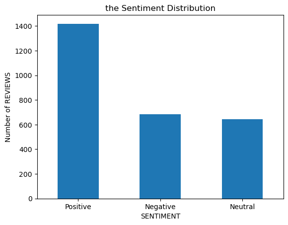
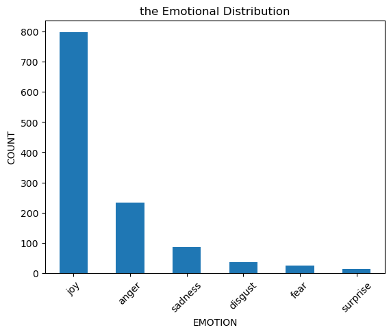
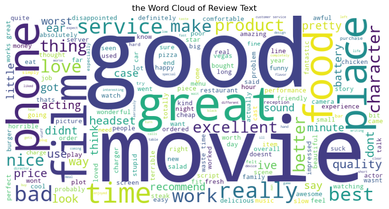
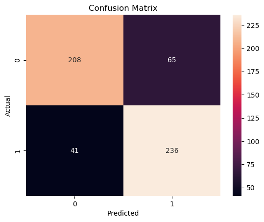
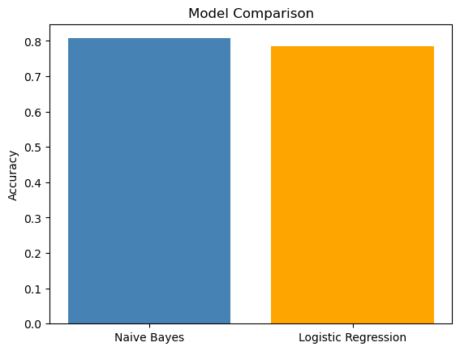

# 📊 Sentiment Analysis using Machine Learning & NLP

## 🚀 Project Overview

This project focuses on analyzing customer sentiment across multiple platforms — **Amazon, IMDb, and Yelp** — using Natural Language Processing (NLP) and Machine Learning techniques.

The goal is to transform **unstructured text data** into **actionable insights** by classifying reviews as positive or negative and understanding patterns in customer sentiment.

---

## 🎯 Business Context

In today's data-driven environment, organizations rely heavily on customer feedback to guide:

- Product improvements  
- Marketing strategies  
- Customer experience optimization  

This project demonstrates how machine learning can be applied to **automate sentiment classification at scale**, enabling faster and more informed decision-making.

---

## 🧠 Techniques & Methodology

### 🔹 Text Processing & Feature Engineering
- Text cleaning and preprocessing  
- TF-IDF (Term Frequency–Inverse Document Frequency)  

### 🔹 Sentiment Analysis
- VADER (Valence Aware Dictionary and Sentiment Reasoner)  
- Custom lexicon-based approach  

### 🔹 Machine Learning Models
- Naive Bayes (MultinomialNB)  
- Logistic Regression  

### 🔹 Model Evaluation
- Accuracy Score  
- Classification Report (Precision, Recall, F1-Score)  
- Confusion Matrix  

---

## 📈 Model Performance

| Model                | Accuracy |
|---------------------|----------|
| Naive Bayes         | ~81%     |
| Logistic Regression | ~78%     |

👉 **Insight:**  
Naive Bayes performed slightly better for this dataset, likely due to its effectiveness with high-dimensional sparse text data.

---

## 📊 Visualizations

### 🔹 Sentiment Distribution

### 🔹 Emotion Distribution

### 🔹 Word Cloud

### 🔹 Confusion Matrix (Naive Bayes)

### 🔹 Model Comparison

---

## 📂 Dataset

- Combined dataset of:
  - Amazon Reviews  
  - IMDb Reviews  
  - Yelp Reviews  
- Total observations: ~2,748  
- Labels:
  - `1` → Positive  
  - `0` → Negative  

---

## ⚠️ Limitations

- Binary classification (does not capture nuanced emotions)  
- Dataset size relatively small for deep learning approaches  
- Model performance may vary on real-world unseen data  

---

## 🔍 Key Takeaways

- NLP + Machine Learning can effectively classify sentiment from text data  
- Feature engineering (TF-IDF) plays a critical role in performance  
- Naive Bayes remains a strong baseline model for text classification tasks  

---

## 🛠️ Tools & Technologies

- Python (pandas, NumPy, scikit-learn)  
- NLP (VADER, custom lexicon approach)  
- Visualization (matplotlib, seaborn)  
- Jupyter Notebook  

---

## 📁 Project Structure

---

## 📊 Principal Component Analysis (PCA) on the Dow Jones Index

---

## 📌 Problem Statement

Financial datasets often contain highly correlated variables, making analysis complex and redundant.  
The objective of this project is to apply **Principal Component Analysis (PCA)** to:

- Reduce dimensionality  
- Identify hidden structure in the data  
- Retain maximum variance with fewer components  

---

## 📂 Dataset

- **Source:** Dow Jones Index dataset  
- **Features Used:**
  - Open
  - High
  - Low
  - Close
  - Volume  

---

## ⚙️ Data Processing

- Checked correlations between variables  
- Standardized features before applying PCA  
- Prepared data for dimensionality reduction  

---

## 📉 Visualizations

### 🔹 Correlation Matrix (Before PCA)
Shows strong correlations among price-related features → justification for PCA  

---

### 🔹 Scree Plot
Displays explained variance per principal component  

---

### 🔹 Cumulative Explained Variance
Helps determine optimal number of components  

---

### 🔹 PCA 2D Projection
Visual representation of data using first two principal components  

---

## 🧠 PCA Implementation

- Applied PCA using `scikit-learn`
- Reduced dataset into principal components  
- Identified that a small number of components explain most variance  

---

## 📊 Key Insights

- Strong correlation exists among stock price variables  
- PCA effectively reduces redundancy in the dataset  
- Majority of variance captured within first few components  
- Dimensionality reduction simplifies analysis without major information loss  

---

## 🔍 Key Takeaways

- PCA is powerful for financial data with multicollinearity  
- Helps in feature reduction and visualization  
- Useful preprocessing step for machine learning models  

---

## 🛠️ Tools & Technologies

- Python (pandas, NumPy, scikit-learn)
- Data Visualization (matplotlib, seaborn)
- Jupyter Notebook

---

## 📁 Project Structure
